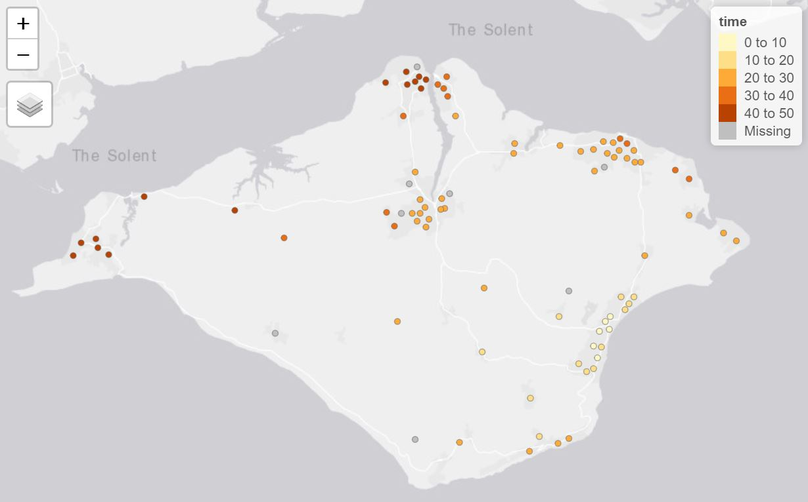

```{r, include = FALSE}
knitr::opts_chunk$set(
  collapse = TRUE,
  comment = "#>"
)
```

The Analyst is a set of optional features in OTP 1.x used for transport analysis. These features were removed from OTP 2.0.  This Vignette will explain how to enable and use these features.

## Analyst Features

The Analyst add the following feature to OTP:

1. **PointSets** - A more efficient way to specify a batch of fromPlace / toPlaces for routing.
1. **Surfaces** - A efficient way to get travel time from one to many places.
1. **Isochrones** - An alternative implementation of the Isochrone features.

## Loading OTP with the Analyst

The analyst is an optional feature in OTP 1.x and can be loaded in `otp_setup`.

```{r eval=FALSE}
# Get OTP and the Demo Data in the normal way
library(opentripplanner)
path_data <- file.path(tempdir(), "OTP")
dir.create(path_data)
path_otp <- otp_dl_jar(version = "1.5.0") #Must use OTP 1.x
otp_dl_demo(path_data)
log1 <- otp_build_graph(otp = path_otp, dir = path_data)

# Setup OTP with the analyst and pointsets enabled
log2 <- otp_setup(otp = path_otp, dir = path_data, analyst = TRUE, pointsets = TRUE)
otpcon <- otp_connect(timezone = "Europe/London")
```
You can see the analyst is working in the web UI.

```{r, echo = FALSE, fig.align='center', fig.cap="\\label{fig:analystui}OTP Web Interface in Analyst Mode"}
knitr::include_graphics("images/analyst.jpg")
```
## Creating a Pointset

You will have noticed that when we started OTP we also enabled the Pointsets feature. Pointsets are `.csv` files of latitude/longitude coordinate that OTP can route to. PointSets can be created from SF objects using the `otp_poinset()` function.

We will use the LSOA points to create a PointSet. We will also add a column of data called jobs to analyse. For any numerical values in a PointSet OTP can provide the count and sum of that value based on travel criteria. In this case we migh want to know how many jobs can be accessed within a 30 minute drive of a given location.

```{r, eval=FALSE}
lsoa <- sf::st_read("https://github.com/ropensci/opentripplanner/releases/download/0.1/centroids.gpkg", stringsAsFactors = FALSE)
lsoa$jobs <- sample(100:500, nrow(lsoa))
otp_pointset(lsoa, "lsoa", path_data)
```

Here the `otp_pointset()` function takes the `lsoa` object and create a PointSet that can be accessed by OTP using the name "lsoa".

## Creating a Surface

A surface evaluate the travel times from a given point to all locations within 120 minutes in one minute increments. So it quite similar to an isochrone.

The fist step is to make a surface using `otp_make_surface`

```{r eval=FALSE}
surfaceid <- otp_make_surface(otpcon, c(-1.17502, 50.64590))
```

The `otp_make_surface` function returns a list containing the surface ID and the parameters used to create the surface. You can use this object in other functions that support surfaces.

Once the surface has been made we can evaluate the travel times to our pointset.

```{r eval=FALSE}
ttimes <- otp_surface(otpcon, surfaceid, "lsoa")
```

The `otp_surface` function returns a list of two objects. The first object `data` is a data frame summarising the sum and count of any values in the pointset in one minute increments from the `fromPlace` specified by the `surfaceid` object. The second object `times` is a vector of travel times in seconds to each of the locations in the pointset. NA values are returned if OTP was unable to find a route to the point or if the point is more than 120 minutes from the `fromPlace`

We can visualise the travel times using the `tmap` package.

```{r eval=FALSE}
lsoa$time <- ttimes$times / 60
library(tmap)
tmap_mode("view")
tm_shape(lsoa) +
  tm_dots(col = "time")
```

```{r, echo = FALSE, fig.align='center', fig.cap="\\label{fig:ttimes}Travel times to LSOA points"}

```

## Producing a travel time matrix

We can use surfaces as a more efficient way to produce a travel time matrix than using `otp_plan`. A special function `otp_traveltime` create batches of surfaces and pointsets an summarises the results as a travel time matrix.

```{r eval=FALSE}
ttmatrix <- otp_traveltime(otpcon, path_data, 
                           fromPlace = lsoa,
                           toPlace = lsoa,
                           fromID = lsoa$geo_code,
                           toID = lsoa$geo_code)
```
The function will return the travel times in seconds between the fromPlaces and toPlaces as a data frame. With columns names from `fromID` and row names from `toID`. Any failed routes will return and NA, as will any greater than 120 minutes.

If a whole row of column is NA, it is likely that point is too far from the road network to route, or the `mode` does not allow access (e.g. driving up a pedestrianised road). You could try modifying your point locations slightly to allow OTP to find a valid route. 
