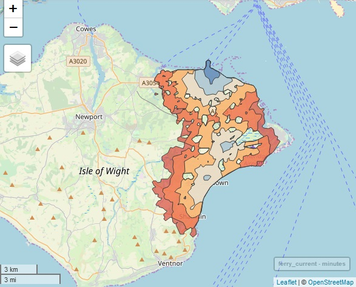

## Introduction

The vignette introduces some of the more advanced features of OTP and gives some examples of the types of analysis that are possible when using OTP and R together.

### Recap

For this vignette, we will use the same data as the [Getting Started vignette](https://itsleeds.github.io/opentripplanner/articles/opentripplanner.html) vignette. If you have not yet created the example graph you can set it up with the following commands. If you are using non-default settings see the Getting Started vignette for full details.

```{r eval =FALSE}
library(opentripplanner)
# Path to a folder containing the OTP.jar file, change to where you saved the file.
path_otp <- "C:/Users/Public/otp.jar"
path_data <- getwd() # find the current working directory
log <- otp_build_graph(otp = path_otp, dir = path_data)
otp_setup(otp = path_otp, dir = path_data, analyst = T)
otpcon <- otp_connect()

```

## Batch Routing

The `otp_plan()` function can produce multiple routes at once. In this example, we will gather data on travel times between each of the [LSOAs](https://www.ons.gov.uk/methodology/geography/ukgeographies/censusgeography) on the Isle of White and the [Ryde Ferry](https://www.wightlink.co.uk/go/isle-of-wight-ferry-routes-destinations/) .

`otp_plan()` accepts three types of input for the `fromPlace` and `toPlace`: a numeric longitude/latitude pair; a 2 x m matrix where each row is a longitude/latitude pair; or an SF data.frame of only POINTS. The number of `fromPlace` and `toPlace` must be the same or equal one (in which case `otp_plan()` will repeat the single location to match the length of the longer locations.

We'll start by importing the locations of the LSOA points.

```{r, eval=FALSE}
lsoa <- sf::st_read("https://github.com/ITSLeeds/opentripplanner/releases/download/0.1/centroids.gpkg")
head(lsoa)
```

Then we will define our desitnation as the Ryde Ferry:

```{r, eval=FALSE}
toPlace <- c(-1.159494,50.732429)
```

Now we can use the `otp_plan()` to find the routes

```{r, eval=FALSE}
routes <- otp_plan(otpcon = otpcon,
                    fromPlace = lsoa,
                    toPlace = toPlace)
```

**Note** `otp_plan()` supports multi-core processing via the `ncores` input. Runnin on `ncores = 2` provides around 35% performance boost. However, you are unlikely to get a significant improvement (on typical computers) using more than 3 cores, as you will overload OTP.

You may get some error message returned as OTP is unable to find some of the routes. The `otp_plan()` will skip over errors and return all the routes it can get. It will then print out any error messages. You will have also noticed the handy progress bar.

You can plot the routes using `tmap` 

If you do plot all the routes it should look something like this:

```{r, echo=FALSE, fig.align='center', fig.cap="\\label{fig:route2airport}Driving Routes to Rye Ferry"}
knitr::include_graphics("images/routes_to_ferry.jpg")
```

### All to All routing

It is sometimes useful to find the route between every possible orign and desitantion for example when producing an OD matrix. If you wished to route from every LSOA to every other LSOA point this can easily be done by repeating the points. 

```{r, eval=FALSE}
toPlace   = lsoa[rep(1:nrow(lsoa), times = nrow(lsoa)),]
fromPlace = lsoa[rep(1:nrow(lsoa), each  = nrow(lsoa)),]
```

**Warning** routing from all points to all other point increases the total number of routes to calculate exponentially. In this case 89 points results in 89 x 89 = 7921 routes, this will take a while.

For and OD matrix you may only be intrested in the total travel time and not require the route geometry. By setting `get_geometry = FALSE` in `otp_plan()` R will just return the meta-data and discard the geometry. This is slightly faster than when using `get_geometry = TRUE` and uses less memory.

## Isochrones

Isochones a lines of equal time. Suppose we are interested in visualising how long it takes to access Ryde ferry using public transport from different parts of the island. We will do this by requesting isochrones from OTP for 15, 30, 45, 60, 75 and 90 minutes. This can be achieved with a single function `otp_isochrone()`.

Isochrones requires the analyst extension to OTP. 

```{r eval=FALSE}
ferry_current  <- otp_isochrone(otpcon = otpcon,
            fromPlace = c(-1.159494, 50.732429), # lng/lat of Ryde ferry
            mode = c("WALK","TRANSIT"),
            maxWalkDistance = 2000,
            date_time = as.POSIXct(strptime("2018-06-03 13:30", "%Y-%m-%d %H:%M")),
            cutoffSec = c(15, 30, 45, 60, 75, 90) * 60 ) # Cut offs in seconds
ferry_current$minutes = ferry_current$time / 60 # Convert back to minutes

```

We can visualise the isochrones on a map using the `tmap` package.

```{r, eval=FALSE}
library(tmap)                       # Load the tmap package
tmap_mode("view")                   # Set tmap to interative viewing
map <- tm_shape(ferry_current) +  # Build the map
  tm_fill("minutes",
          breaks = c(0, 15.001, 30.001, 45.001, 60.001, 75.001, 90.001),
          style = "fixed",
          palette = "-RdYlBu") +
  tm_borders()
map                                 # Plot the map
```

You should see a map like this.

```{r, echo=FALSE, fig.align='center', fig.cap="\\label{fig:otpgui}Isochrones from Ryde ferry"}

```


## Geo-coding

OTP has a built in geo-coder to allow you to search for places by names.
```{r, eval=FALSE}
stations <- otp_geocode(otpcon = otpcon, query = "station")
```

