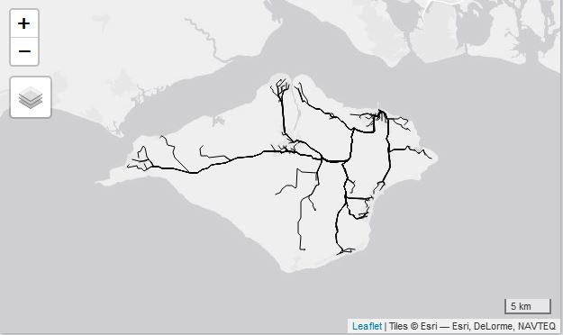

```{r, include = FALSE}
knitr::opts_chunk$set(
  collapse = TRUE,
  comment = "#>"
)
```

```{r setup}
library(opentripplanner)
```

The main purpose of this vignette is to document the work to improve routing speed for version 0.3.0.0 but will additional compare the performance with the `otpr` package.

## The challange

```{r map, eval=FALSE}
path_data = "C:/Users/malco/Downloads/otp_test"
path_otp = otp_dl_jar(path_data)
otp_setup(path_otp, path_data)

cents <- pct::get_centroids_ew()
cents <- sf::st_transform(cents, 4326)

fromPlace = sf::st_sfc(list(sf::st_point(c(-5.55359, 50.11001))), crs = 4326)
fromPlace = sf::st_as_sf(data.frame(id = 1, geometry = fromPlace))

otpcon <- opentripplanner::otp_connect()
```
The map below shows the 7201 population weighted centroids of MSOAs in England and Wales in black and a single starting point in red. The routing task is to find the driving time from the parting point to all the MSOAs. Some of the MSOA centorids are too far from the road to be routeable so the task is also handle these errors.

```{r, echo=FALSE, fig.align='center', fig.cap="\\label{fig:msoa}MSOAs in England and Wales (black) and starting point (red)"}

```


```{r old, eval=FALSE}
system.time({
  r1 <- otp_plan(otpcon, fromPlace, cents, ncores = 4,
               get_geometry = FALSE)
})
r1 <- otp_plan(otpcon, c(-5.55359, 50.11001), cents[1,], ncores = 1,
               get_geometry = FALSE)
#user  system elapsed 
#4.77    2.76  874.79 
```


```{r new, eval=FALSE}
system.time({
  r2 <- otp_plan(otpcon, fromPlace, cents, 
                 fromID = "start", toID = cents$msoa11cd,
                 ncores = 4, get_geometry = FALSE,
                 distance_balance = TRUE )
})
#user  system elapsed 
#5.83    4.27  749.80 

#user  system elapsed with handle
#5.61    3.70  788.35
asjson <- RcppSimdJson::fparse(json_example_transit)

profvis::profvis({
  for(i in 1:1000){
    r2 <- opentripplanner:::otp_json2sf(asjson, get_elevation = FALSE)
  }
}, interval = 0.005)
```
