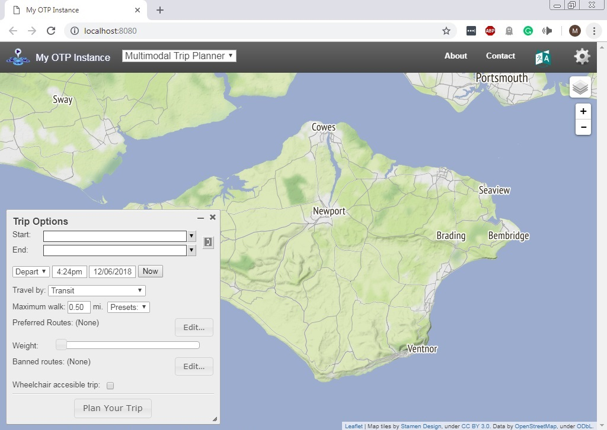

## Introduction

This tutorial is an introduction to OpenTripPlanner (OTP) - an open-source and cross-platform multi-modal route planner written in JAVA. It uses imported Open Street Map (OSM) data for routing on the street and path network and supports
multi-agency public transport routing through imported GTFS feeds. It can also apply a digital elevation model to the OSM street network, allowing, for example, cycle-friendly routes to be requested. OTP has a web front-end that can be used by end-users, and a sophisticated routing API.

A major advantage of running your own multi-modal route planner is the ability to carry out analysis using amended transport data. Services such as as Google Maps or TransportAPI are based on current public transport schedules and the existing road network. OTP enables you to modify transit schedules and/or make changes to the underlying street network. By editing a local copy of OSM, you can model the effects of opening new roads, closing roads, or imposing other restrictions. You can also look back in time. For example, you might want to examine the effect of reductions in rural bus services on accessibility of health facilities. To do this you would need a network with bus schedules as they were in previous years.

## Installation

The following commands will install and attach the package:

```{r, eval=FALSE}
# install.packages("devtools")
devtools::install_github("marcusyoung/opentripplanner")
library(opentripplanner)
```

Before you can use the package, you should set-up the OpenTripPlanner Java program.
You will need to download the latest version of OTP from https://repo1.maven.org/maven2/org/opentripplanner/otp/ , which can be done as follows (this downloads the file into a folder called `programs` in your home directory on Linux/Mac):

```{r, eval=FALSE}
# download file (may want to do this manually)
url_otp <- "https://repo1.maven.org/maven2/org/opentripplanner/otp/1.3.0/otp-1.3.0-shaded.jar"
download.file(url = url_otp, destfile = "~/programs/otp.jar")
```

OTP requires Java 8 https://www.java.com/en/download/ . If possible the 64Bit version of Java is preferable, especially if you want to use OTP over large areas.
To install Java 8 on Linux, we recommend instructions at [medium.com/coderscorner](https://medium.com/coderscorner/installing-oracle-java-8-in-ubuntu-16-10-845507b13343).

If you are unfarmialr with R and Open Tripe Planner see the Dummies Guide vignette incuded with this package.


## Building an OTP Graph

We will build an example graph for Greater Manchester using the data provided in the package. A graph is what OTP uses to find routes, and must be built out of the raw data provided. 

```{r eval=FALSE}
# Install Java 8
# Download and save the latest version of OTP

# Path to a folder containing the OTP.jar file, change to where you saved the file.
path_otp <- "C:/otp"

# or on max/linux
path_otp <- "~/programs/otp.jar"
path_otp <- normalizePath(path_otp)

# Path to the sample data

path_data <- getwd() # assuming your data is here
# Build a graph and save the logs
download.file("https://github.com/marcusyoung/opentripplanner/releases/download/0.0.1/demo-graph.zip",
              "demo-graph.zip")
unzip("demo-graph.zip")
log <- otp_build_graph(otp = path_otp, dir = path_data) 
```

This code will create a new file `Graph.obj` that will be saved in the location defined by `path_data`. 

### Building your own OTP Graph

If you want to build your own graph for a different location follow these steps, and change your `path_data` varible to the folder with your data.

An OTP graph specifies every location in the region covered and how to travel between them, and is compiled by OTP using OSM data for the street and path network (used for walk, bicycle and drive modes) and GTFS data for transit scheduling.

Our first task is to create the folder and file structure expected by OTP. This is a base directory called `otp` which contains a sub-directory called `graphs`. Directories created under `graphs` are known as OTP routers, and contain all the files required to build a graph. A single OTP instance can host several routers, for example covering different regions. 

Create a router called 'current', and include the GTFS and OSM files for the road network and current transit schedules for Greater Manchester, along with `router-config.json`, as shown below:


```{r, engine='bash', eval=FALSE}
/otp                         # Your top folder for story all OTP data
  /graphs                     
     /current                 # Sub folder with the name or the router
         osm.pbf              # Required OSM road map
         router-config.json   # Required config file
         gtfs.zip             # Optional GTFS data
         dem.tif              # Optional Elevation data
         
```

`router-config.json` is actually read when the OTP server is started (in the next section), but we add it now for convenience.

## Launch OTP and load the graph

The next step is to start up your OTP server, running the router called 'current'. OTP will load the graph you created into memory and you will then be able to plan multi-modal routes using the web interface. From the `otp` directory, run the following command:

```{r, eval = FALSE}
otp_setup(otp = path_otp, dir = path_data)
```

OTP has a built-in web server called Grizzly which runs on port 8080 (http) and 8081 (https). If you have another application running on your computer that uses these ports then you will need to specify alternative ports using the `port` and `securePort` options, for example:

```{r, eval = FALSE}
otp_setup(otp = path_otp, dir = path_data, port = 8801, securePort = 8802)
```

It should only take a minute or two for OTP to load the graph and start the Grizzly server. If all has worked you should see the message: `OTP is ready to use` and R will open your web browser at the OTP.

You can also access the web interface using the URL: [http://localhost:8080](http://localhost:8080). **Note:** The web interface does not work correctly in Internet Explorer - use Firefox or Chrome. You can now zoom into the Manchester area and request a route by setting an origin and a destination directly on the map (by right clicking your mouse) and you can specify travel dates, times and modes using the 'Trip Options' window (see Figure \ref{fig:otpgui}). You can change the background map from the layer stack icon at the top right.

```{r, echo = FALSE, fig.align='center', fig.cap="\\label{fig:otpgui}OTP Web GUI"}

```


## Connecting to the OTP from R

Now you have the OTP running on your computer you can let R connect to the OTP.

```{r, eval = FALSE}
otpcon <- otp_connect()
```

The connection is created and tested, a message will be returned saying if the connection exists or not. 

If you have not used the default settings, such as a different `port` you can speficy those settings in `otp_connect()`

```{r, eval = FALSE}
otpcon <- otp_connect(hostname =  "localhost", router = "current", port = 8801)
```

`otp_connect()` creates an OTP connection object which will allow R to connect to the OTP. 

## Getting a route from the OTP

Now we can use R to get a route from the OTP. OTP accepts lattitute and longitude cooridantes for a `fromPlace` (start of the jounrey) and `toPlace` (end of journey).

```{r, eval = FALSE}
route <- otp_plan(otpcon, fromPlace = c(53.48478, -2.29786), toPlace = c(53.46680, -2.21169))
```

If you have the `tmap` package installed you can view the route using.

```{r, eval = FALSE}
install.packages("tmap")  # Only needed if you don't have tmap
library(tmap)             # Load the tmap package
tmap_mode("view")         # Set tmap to interative viewing
qtm(sf::st_zm(route))     # Plot the route on a map
```

Notice the use of `sf::st_zm(route)` this is because `tmap` does not currently support XYZ coordinates

## Stopping the OTP

As the OTP is running in JAVA it will conitune to run after you close R.

You can stop the OTP running using the command. **NOTE: This will stop all running JAVA applications!**

```{r, eval = FALSE}
otp_stop()
```

Congratulations, you now have your own multi-modal router planner!
